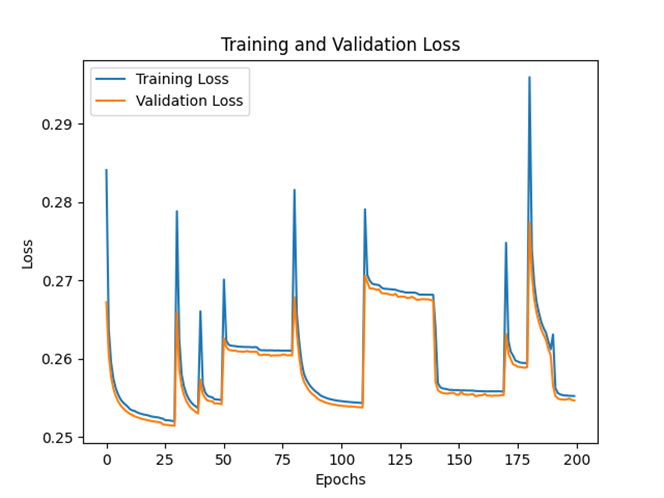
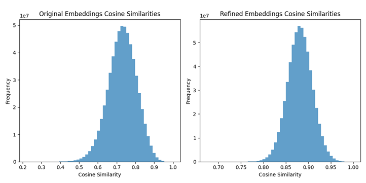
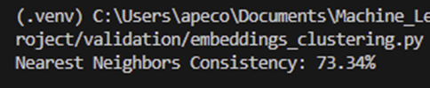

# Scientific Literature Search Assistant using RAG

## Project Motivation
This project implements a Retrieval Augmented Generation (RAG) system to search scientific papers. As a student, it's always hard to find good matching scientific Papers on Google for research purposes. For this problem i wanted to develop a RAG System, so that it becomes easier to find scientific Papers when doing a reasearch project f.e. the bachelor thesis.

## Getting Started
### Prerequisites
- Python 3.8+
- Virtual Environment / installation using requirements.txt

### Installation
1. Clone the repository:
   ```bash
   git clone alepeco/RAG_Project_ML2
   cd alepeco/RAG_Project_ML2
2. Download the data from https://www.kaggle.com/datasets/Cornell-University/arxiv, place it into the /data/raw folder, and make the data shorter as it takes a lot     of time for embedding. In my case, I used about 24000 records and it took 3.5 hours to create the embeddings
3. Start "src/data_preparation_csv.py". This will place a CSV in the processed folder including the embeddings.
4. Start "src/data_preprocessing.py". This will preprocess the data and create training & validation sets and place them in the folder "data"
5. Start "src/train.py". Here, a Neural Network is trained and validated to create the best refined embeddings to query for the data.
6. Start "App.py" and query for a , the result will be the metadata and abstract of matching scientific papers.

### Validation

(Referenziert Diagramm /validation/images/Figure_Model_training.png)
 
The plot shows the training and validation losses over the epochs during the hyperparameter tuning process. The training and validation losses generally converge towards similar values, indicating that the model is learning and generalizing reasonably well to the validation set. Periodic spikes in the training and validation losses are due to the changes in hyperparameters across different hyperparameter tuning iterations. Each set of hyperparameters will start training from scratch, leading to an initial higher loss that decreases as the model learns. The close tracking of training and validation losses suggests that the model is not significantly overfitting. If the training loss were much lower than the validation loss, it would indicate overfitting. The lowest points in the validation loss curve represent the best performance of the model with a particular set of hyperparameters. These points are critical for identifying the best model. The abrupt changes in the loss values correspond to changes in the hyperparameters, suggesting that some hyperparameter configurations lead to better initial performance than others.
From the plot, we can see that the model's training and validation losses decrease and converge over time, suggesting effective learning.


(Referenziert Histogramm /validation/images/Figure_cosine_Similarity.png)
 
Average Original Cosine Similarity: 0.7294282913208008
Average Refined Cosine Similarity: 0.8814812898635864

The histograms and average cosine similarity values give insight into the refinement of the embeddings. The histogram for the original embeddings shows a distribution of cosine similarities centered around 0.7, indicating a moderate level of similarity among most pairs of embeddings, with some pairs showing less similarity and others more. In contrast, the histogram for the refined embeddings is centered around 0.88, indicating a higher level of similarity and a more consistent similarity distribution among the refined embeddings.
The average cosine similarity values further illustrate this improvement. The average original cosine similarity is 0.729, reflecting a moderate level of similarity. After refinement, the average cosine similarity increases to 0.881, indicating that the refined embeddings are generally more similar to each other. This increase in similarity and the narrower distribution in the refined embeddings suggest that the autoencoder training process successfully mapped the embeddings into a more structured and meaningful latent space.
Overall, the results show that the refinement process effectively increased the similarity and consistency of the embeddings, making them more suitable for tasks requiring high-quality, semantically meaningful representations, such as information retrieval and clustering.

 
Nearest Neighbors Consistency Score:
The Nearest Neighbors Consistency score of 73.34% means that approximately 73.34% of the nearest neighbors in the original embeddings remain the same in the refined embeddings. This suggests that the refinement process has preserved a significant portion of the original neighborhood structure.
The Nearest Neighbors Consistency score demonstrates that the refinement process has maintained a good level of consistency in the neighborhood structure of the embeddings. Although there is still room for improvement, a score of 73.34% indicates that the refined embeddings are largely consistent with the original embeddings in terms of nearest neighbors. This consistency is a positive outcome, suggesting that the refinement process did not significantly alter the local relationships within the embedding space. Further improvements could focus on increasing this consistency score to enhance the quality of the refined embeddings.

Model Architecture:
An autoencoder was chosen for this project due to its ability to learn compressed representations of data, making it suitable for refining embeddings. Autoencoders are effective in capturing the most significant features of the data, reducing noise, and improving the quality of the embeddings. By training the autoencoder on the initial embeddings, the model was able to learn a more structured and informative representation, as evidenced by the improved cosine similarity scores.

Hyperparameters:
Hyperparameters were selected using a grid search approach, where various combinations of learning rate, hidden dimension size, batch size, and the number of epochs were tested. This exhaustive search allowed for the identification of the best performing model configuration. The impact of hyperparameters on performance was significant, as different combinations resulted in varying levels of loss reduction. The chosen hyperparameters (e.g., a learning rate of 0.001, hidden dimension size of 256, batch size of 16, and 30 epochs) provided the optimal balance between training time and model accuracy.

Training Data:
The training data consisted of a diverse set of arXiv abstracts and their corresponding embeddings. The quality and quantity of this data were crucial in achieving meaningful results. High-quality embeddings from the BERT model provided a strong starting point for the autoencoder. The dataset was sufficiently large to allow the model to generalize well, capturing various nuances in the data. However, any biases or limitations in the dataset would directly influence the model's performance, underscoring the importance of using comprehensive and representative data.

Validation:
Validation was conducted through multiple steps, including tracking training and validation loss, cosine similarity analysis, and clustering visualization. The results showed a steady decrease in both training and validation loss, indicating effective learning by the model. The average cosine similarity scores improved from 0.729 to 0.881, demonstrating the effectiveness of the autoencoder in refining embeddings. Clustering analysis further supported these findings, with the refined embeddings showing more distinct cluster formations. The Nearest Neighbors Consistency score of 73.34% highlighted that the local structure of the embeddings was well-preserved, although there is still room for improvement. These validation steps confirmed the model's ability to enhance the quality of the embeddings while maintaining the original neighborhood structure.

In conclusion, the choices made during the development of the model, from the selection of an autoencoder architecture to the tuning of hyperparameters and the careful consideration of training data, all contributed to the successful refinement of embeddings. The validation results demonstrated significant improvements, validating the approach.